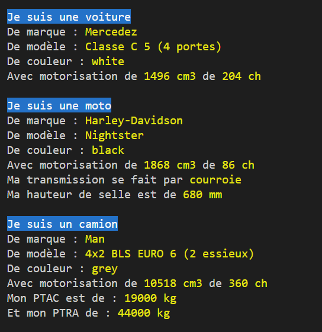

###### Intro à la programmation orientée objet
# Les classes Bike et Truck
## Brief de l'exercice

Si vous avez bien suivi le chapitre précédent, vous devriez avoir compris le principe de base de l'implémentation d'une classe.

Du coup, vous allez maintenant pouvoir créer from scratch vos deux premières classes de toutes pièces :

- **Bike** : dans le fichier *"lib/Bike.js"* va représenter une moto
- **Truck** : dans le fichier *"lib/Truck.js"* va représenter un camion

Pour cela, vous pouvez repartir de votre résultat de l'exercice précédent, ou utiliser les fichiers ci-joints qui contiennent toute la correction de l'exercice sur la classe **Car**.

Vous devrez créer les deux classes **Bike** et **Truck** entièrement à la mains. Elle vont fonctionner exactement sur le même principe que la classe **Car**, à ceci près que les données ne seront pas forcément les mêmes. 

## Données spécifiques = classes spécifiques

Déjà, le nombre de portes n'a aucun sens sur une moto, et ce n'est d'ailleurs pas très utile à savoir pour un camion. Il ne faudrait donc pas reprendre cette donnée. De plus il y aura de nouvelles données spécifiques à chaque type de véhicule.

**Exemples  :**

- **Motos** :
    - *hauteur de selle* : explicite
    - *transmission* : Chaîne, courroie, cardan...
- **Camions** :
    - *nb essieux* : le nombre d'essieux du camion
    - *ptac* : le poids total autorisé en charge (véhicule + conducteur + marchandises)
    - *ptra* : le poids total roulant autorisé (véhicule + conducteur + marchandises + remorque supplémentaire)

> Note : pour celles et ceux qui trouveraient le sujet peut attrayant car ne les intéressant pas et seraient tentés de se plaindre : si vous vous imaginez que tous vos futurs projets seront tous super sexys et dans vos goûts, vous vous fourrez le doigt dans l'oeil. C'est rare. C'est même l'exception. 
La plupart du temps vous travaillerez sur des données qui ne nous intéressent pas du tout, voir vous rebutent complètement. Attendez d'avoir travaillé sur les résultats de vente de courtiers en assurances, pour une entreprise de semences agricoles ou sur des fiches techniques de pots de peinture ignifugée pour voir.

## Résultat attendu 

Voici un exemple de ce que vous pourriez obtenir en développant correctement vos nouvelles classes :

Là encore, ce ne sont que des exemples, à vous de vous approprier le sujet et d'essayer de créer vos propres classes avec vos propres spécificités. Il y a suffisamment de fiches techniques sur internet pour trouver toutes les données que vous pourriez vouloir ajouter.

